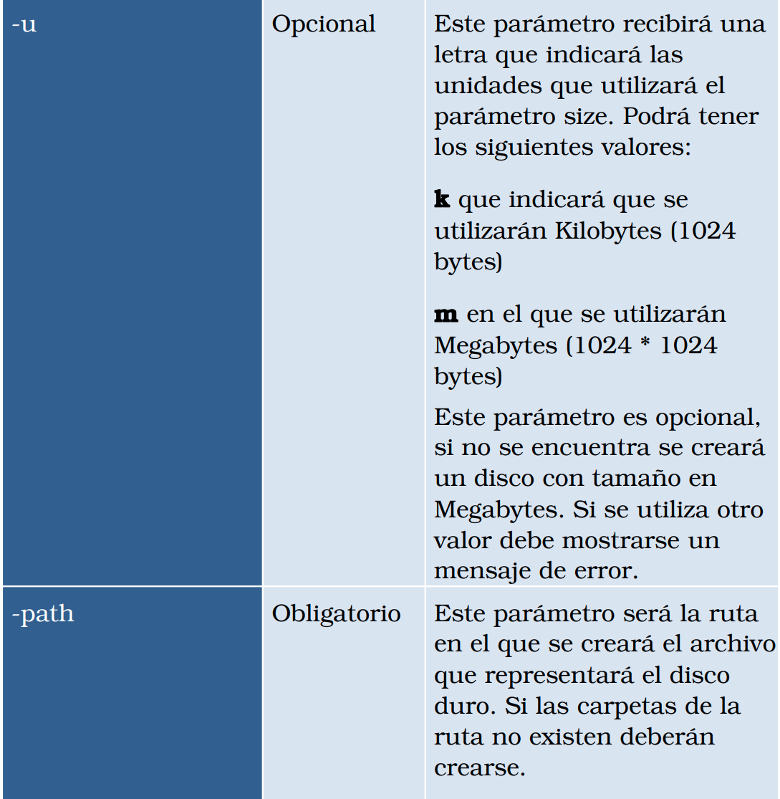

# Manejo e implemetancion de archivos      
--------
-------
## Sistema de archivos ##

Es una aplicación en consola desarrollada en c/c++ que simula los sistemas de archivos EXT2 y EXT3. Este sistema no tiene menus, sino que se utilizaran comandos(scripts) para su manipulación. 

-------- 
--------

## Objetivos ##
- Administrar archivos y escribir estructuras en C/C++
- Comprender el sistema de archivos EXT3 y EXT2
- Aplicar el formateo rápido y completo en una partición
- Aplicar la teoría de ajustes
- Aplicar la teoría de particiones
- Utilizar GraphViz para mostrar reportes
- Restringir y administrar el acceso a los archivos y carpetas en ext3/ext2 por medio de usuarios
- Administrar los usuarios y permisos por medio de grupo

-----
-----

## Comandos ##
-------
------

### Administración de discos

#### Descripcion:
- MKDISK: Crea un archivo binario, simulando un disco duro 
#### Parametros:

------
#### Descripcion:
-  RMKDISK: Borra el archivo que simula el disco duro.
#### Parametros:

------
#### Descripcion:
- FDISK: Administrara las operaciones que se hagan en una particion como crear, eliminar o quitar espacio.
#### Parametros:

-----
#### Descripcion:
- MOUNT: Montara una particion en memoria
#### Parametros:

-----
#### Descripcion:
- UNMOUNT: Desmontara una particion en memoria
#### Parametros:

------
#### Descripcion:
- MKFS: Realiza un formateo completo de la partición, podrá ser ext2 o ext3 y crea un archivo llamado users.txt que tendrá los usuarios y contraseñas del sistema de archivos. 
 #### Parametros:

-----
 
 ### Administración de usuarios y grupos
#### Descripcion:
- LOGIN: Se utiliza para iniciar sesión en el sistema
-  #### Parametros:

------
#### Descripcion:
- LOGOUT: Se utiliza para cerrar sesión
 #### Parametros:
Este comando no recibe ningun parametro

----- 
#### Descripcion:
- MKGRP: Crea un grupo para los usuarios de la partición y se guarda en el archivo users.txt de la partición
-  #### Parametros:

---- 
#### Descripcion:
- RMGRP: Elimina un grupo para los usuarios de la partición
-  #### Parametros:

----- 
#### Descripcion:
- MKUSR: Crea un usuario en la partición
-  #### Parametros:

-----
#### Descripcion:
- RMUSR: Elimina un usuario en la partición
-  #### Parametros:

 
------

### Administración de carpetas, archivos y permisos
#### Descripcion:
- CHMOD: Cambia los permisos de un archivo o carpeta dentro del sistema de archivos
-  #### Parametros:

 
------ 
#### Descripcion:
- TOUCH: Crea un archivo y el propietario será el usuario que actualmente ha iniciado  sesión. Tendrá los permisos 664.
-  #### Parametros:

  
------
#### Descripcion:
- CAT: Permite mostrar el contenido de un archivo, si el usuario que actualmente está logueado tiene acceso al permiso de lectura.
-  #### Parametros:

 
----- 
#### Descripcion:
- RM: Elimina un archivo o carpeta y todo su contenido
-  #### Parametros:

------
#### Descripcion:
- EDIT: Permite editar el contenido de un archivo para asignarle otro contenido
-  #### Parametros:

-----
#### Descripcion:
- REN: Cambia el nombre de un archivo o carpeta
-  #### Parametros:

-----
#### Descripcion:
- MKDIR: Crea una carpeta y el propietario será el usuario que actualmente ha iniciado  sesión. Tendrá los permisos 664.
-  #### Parametros:

-----
#### Descripcion:
- CP: Realiza una copia del archivo o carpeta y todo su contenido hacia otro destino
-  #### Parametros:

-----
#### Descripcion:
- MV: Mueve un archivo o carpeta y todo su contenido hacia otro destino
-  #### Parametros:

-----
#### Descripcion:
- FIND: Realiza una búsqueda por el nombre del archivo o carpeta
-  #### Parametros:

-----
#### Descripcion:
- CHOWN: Cambia el propietario de uno o varios archivos o carpetas
-  #### Parametros:

-----
#### Descripcion:
- CHGRP: Cambia el grupo al que pertenece el usuario
-  #### Parametros:

-----
#### Descripcion:
- PAUSE: Ejecutara un archivo con comandos ya escritos.
 #### Parametros:
Este comando no recibe ningun parametro

------------
#### Descripcion:
- REP: Generara un reporte tipo imagen
 -  #### Parametros:

-----
#### Descripcion:
- EXEC: Ejecutara un archivo con comandos ya escritos.
- -  #### Parametros:

